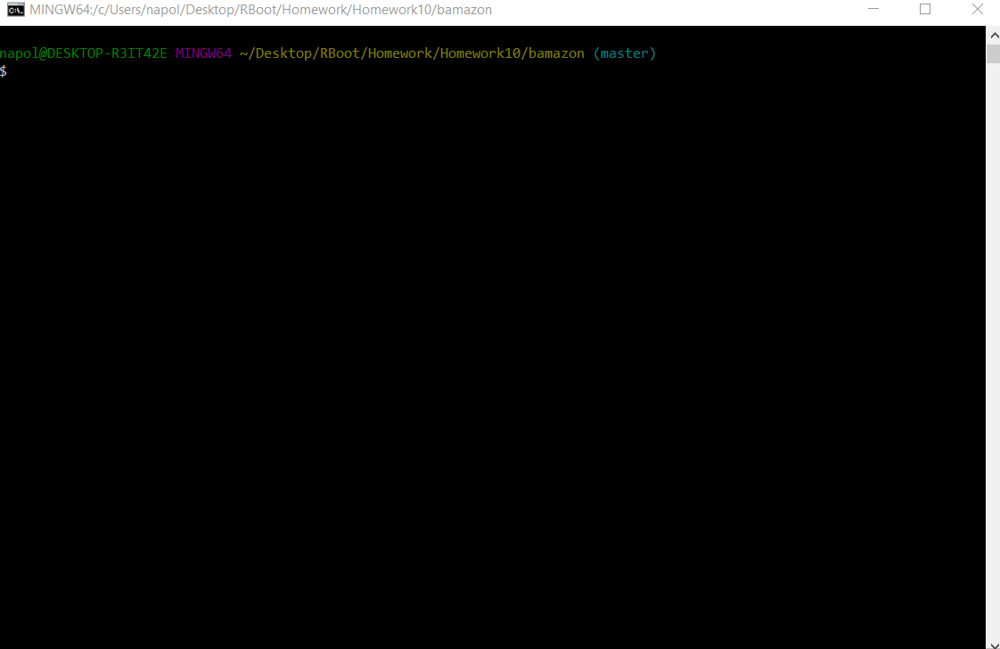
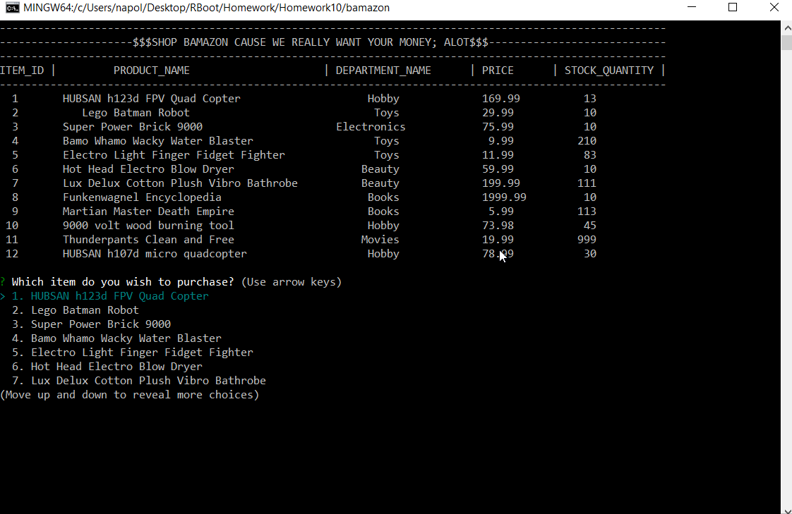
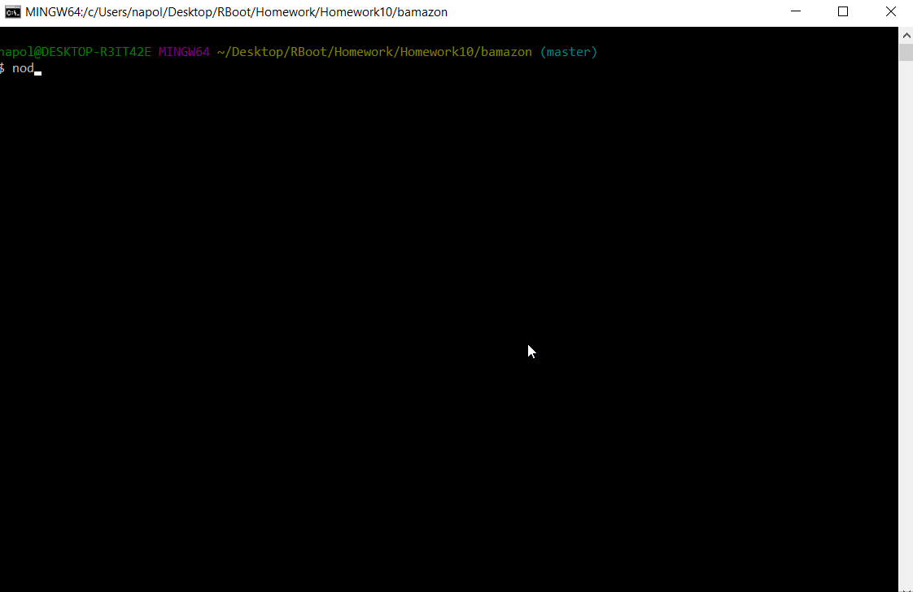
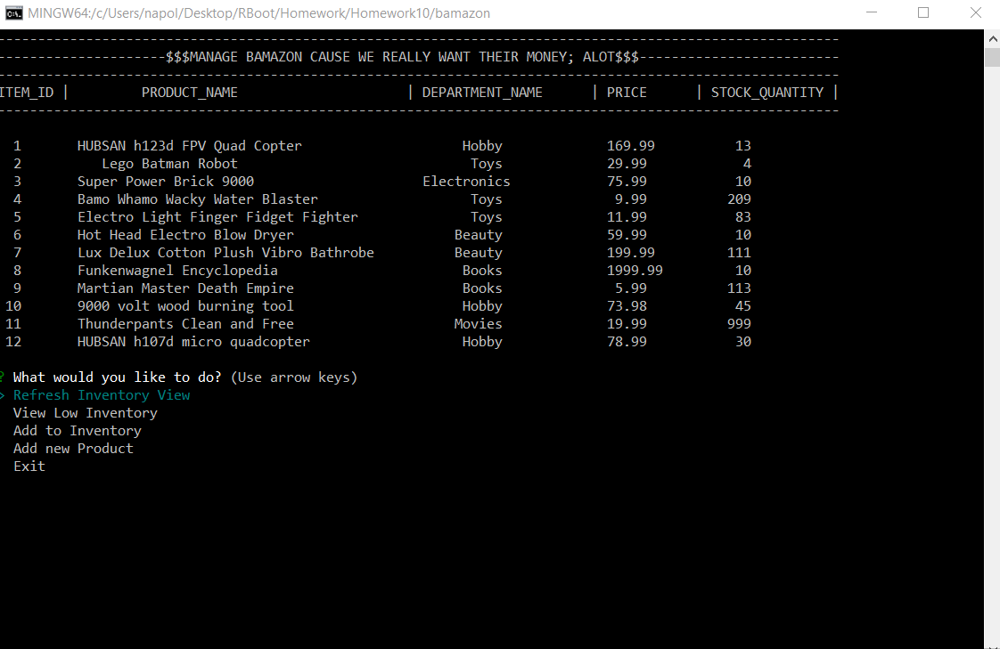
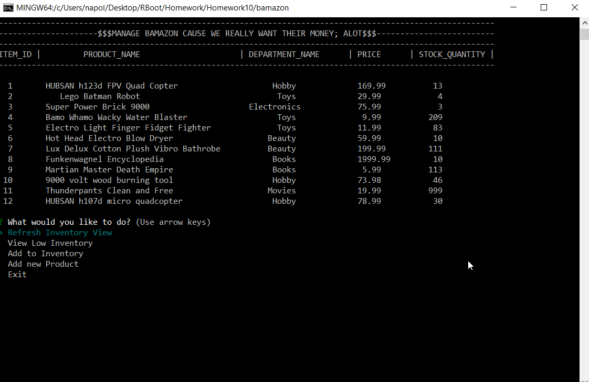
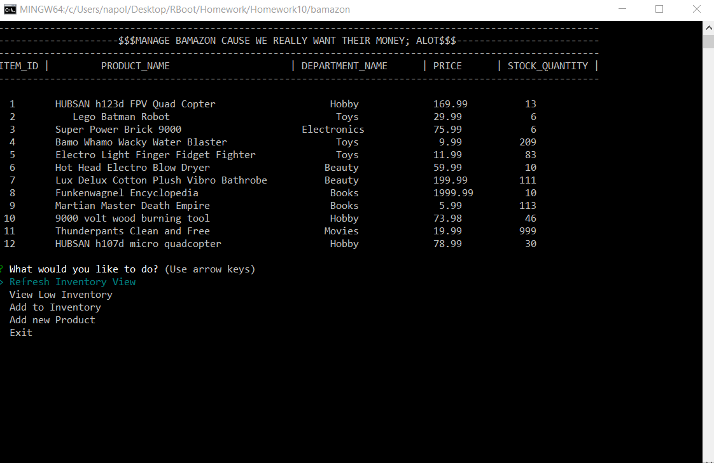

# Bamazon 
### Written by: Anthony Napolitano 4/20/2018
Bamazon is made up of 2 node.js console application (bamazonCustomer and bamazonMaster) that communicates with a mysql database.

# Setup

1) Node setup up: this package requires mysql, dotenv, and inquirer to initialize simply
   run `node init` after cloning the repository from git hub.
2) You will need to run the schema.sql script directly into mysql workbench to create the
   database and populate the tables.
3) You will have to create a .env file and put your personal local mysql password in the file.
    DBPWD=`your local mysql password here`

# bamazonCustomer

To run bamazon as a customer. Open your console, or git to the directory you have cloned into and run: node bamazonCustomer

To buy a product follow these steps:

1) use the arrow keys to select a product from the list.
2) Hit enter to select the product you wish to buy.
3) Now you may select how many of that product you wish to buy; this must be a positive   number.
4) If you picked the wrong product just select 0 as your quantity.
5) After selecting a quantity bamazon will ask you if you wish to continue shopping. Y to continue or N to leave the program.

# bamazonManager    

To run bamazon as a manager. Open your console, or git to the directory you have cloned into and run: node bamazonManager

In management mode you have 5 options:

1) You can Refresh the Inventory View
2) You can View Low Inventory (quantity < 5)
3) You can Add or Receive Inventory
4) You can add a new product.
5) You can exit bamazonManager

### Refresh Inventory View / View Low Inventory

Refreshing the Inventory View will simply relist all the inventory. This function, becomes a little more easy to understand after trying to View Low Inventory.

Viewing low inventory filters the product list to only those products with less than 5 on hand.

### Add Inventory

You may add inventory at anytime in bamazonManager, however, you may only add items in your current view. If you are in a full refresh view, you can add quantity to any item. If you are in the Low quantity view your list is reduced to just items that have low quantity on hand.

Upon selecting an item to add to from the list, you will be asked the quantity you wish to add to your on hand inventory. After this process is complete you will have added inventory for the item you selected.

Below see a manager checking his low inventory view, and then adding items to bring his on hand items for all products above qty of 5.

### Add a new Product

You may also add new products to the offerings at bamazon. To accomplish this simply select Add a product from the managers menu.

You will be asked to name the product, add it to a department or category, give it's price and what quantity you wish to load inventory with initialy.

enjoy bamazon!

